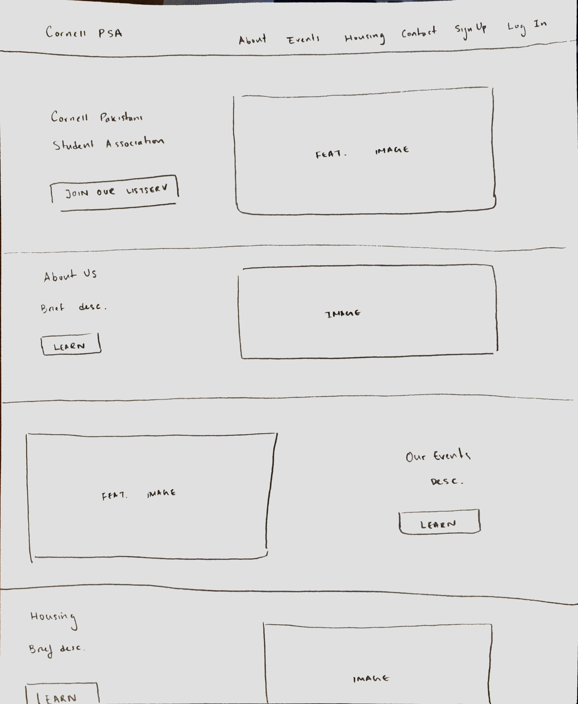

# Project 4 - Design & Plan

Your Team Name: Red Fox

## Milestone 1, Part II: Client Selection

### Client Description

<br/>
**Our client is the Cornell Pakistani Students Association.
They want a website that is geared to all Cornell students and faculty. Their goals are to share organization information with interested members of Cornell as well as connect members with one another.
** <br/>


## Milestone 1, Part III: Client Requirements

### Target Audience(s)

**The audience for this website is all Cornell members. A Cornell student or faculty member would go to this website to learn more about the PSA, and a PSU member can use this site to connect with other members as well as learn about housing opportunities. ** <br/>
### Purpose & Content

<br/>**The purpose of this website is to connect  Cornell students and faculty who are interested in learning more about the PSA or joining the association. It will also serve to display PSA events and allow for users to pair up to find housing together. **<br/>

### Needs and Wants

* OUR NEEDS/WANTS
  * need #1
    * Our client wants the website to be green and white themed (National colors of Pakistan)
    * design idea: We will use CSS styling to accomplish this
  * need #2 (update, since this is outside the scope of this project, we will submit this calendar separately  to the client from the class submission)
    * Our client would like to import the Association's google calendar of events
    * We will use an external library to accomplish this
  * need #3
    * Our client wants their social media pages linked neatly on all pages of their website
    * We will implement a footer on each page (using PHP includes) that shows icons which, when clicked, will link to corresponding social media page
  * need #4
    * Our client wants a forum/comment system where users can submit comments in search of housing partners
    * This can be done with databases.

Example:
* Needs/Wants #1
  * **Needs and Wants** (What does your client and audience need and want?)
    * Client wants to cater to people who speak different languages.
  * **Design Ideas and Choices** (How will you meet those needs and wants?)
    * Create web-pages manually in multiple languages.
    * Use google translate to auto-translate the site on the fly.
  * **Memo** (Justify your decisions; additional notes.)
    * Creating multiple pages manually would require manual skills, effort and time that we do not have.
    * Using auto-translate using Google-Translate API is an easier way to go. Plus, we would like to learn the Google Translate API.

### Hosting Plan

  * Our client can port our code onto a production RDBMS like MySQL to host the website.

### Client's Edits

**Yes the client will need the ability to edit the site after the end of the semester. This will be accomplished by sending them the code and give them the admin account to the site (username and password) that allows them to edit all the information on the site.**

### Information Architecture, Content, and Navigation

Example:
* Content #1
  * **Main Navigation** (List your site's navigation here.)
    * Portfolio
  * **Sub-Categories** (List any sub-categories of under the main navigation.)
    * Websites
    * Mobile Apps
    * Tablets
  * **Content** (List all the content corresponding to main navigation and sub-categories.)
    * *Portfolio*: list all the projects (as images) this client has worked on. When the image is hovered over, display a description of the project; add a search function to enable users search for specific projects;
    * *Websites*: showcase all the websites designed by the client, with thumbnail images and a brief description for each design;
    * *Mobile Apps*: showcase all the mobile apps designed by the client, with thumbnail images and a brief description for each design;
    * *Tablets*: showcase all the tablet applications designed by the client, with thumbnail images and a brief description for each design;

**Target of the site:  All members of Cornell.**

**Style/Theme:**
  * Green and white  (National colors of Pakistan).
  * Inspiration:  Cornell psa's fb page -> recent Mock Dholki.

**Pages:**
  * About us page
  * Events page/Calendar
    * Calendar synced directly from google, using client login info for the google calendar/share it with you once you reach that step.
  * Contacts us page
    * 'Join Our Listserv'
      * adds the user's email to a listserv database
      * admins can copy all the user emails from the admin page to implement in an actual listserv
      * OR simply copy pasted into the list serv website.
  * Home page
    * basic info about the organization
  * Housing Tab
    * Pair students up with others
    * Users send in requests for a roommate and we would try our best to match them or the computer could match them
    * Forum - Students seeking housing will post a comment with details about themselves (neat / messy, early bird / night owl etc..) and email for other students to contact them.

**Client wants maintain the site after (see section above)**

**Client want to keep login features/ new user creation for things like upload pictures from events and participating in the housing forum.**

**Client wants social Media Links using images from flaticon displayed in the footer**


**Client wants the group to Send mock ups before we get started and for us to be in touch about both design and engineering issues.**

### Interactivity

**Interactive features:**
* login system that, if the user is an admin, allows them to edit the site. If a user is logged in, they can access the housing portal
  * This connects with the needs of the clients because logged in users will be valid members who will be in search of housing
  * Also will implement an 'sign up' feature for brand new users
* Housing portal will allow users to input information in a form that will help them get matched up to other students looking for Housing
* Admin page for admin users which allows them to edit user level and view listserv emails
* Google calendar - which is exactly what our client wants (again not in the class submission file because of hotlinking)
<br/>
**PHP elements:**
* navbar and footer includes
* comments system for housing tab ??


### External Code

Google Calendar Integration:
```
<iframe src="https://calendar.google.com/calendar/embed?height=600&amp;wkst=1&amp;bgcolor=%23FFFFFF&amp;src=psacornelluniversity%40gmail.com&amp;color=%231B887A&amp;ctz=America%2FNew_York" style="border-width:0" width="800" height="600" frameborder="0" scrolling="no"></iframe>
```
### Scale

**The site will be about 5 pages. This will require approximately 96 hours of work to complete**

## Milestone 1, Part IV: Work Distribution

**We will rotate design and coding heavy tasks so that each person gets experience with different areas each week. Therefore, we cannot specify at this time any internal dependencies but we will be sure to do so each Tuesday when tasks are allocated. We will ensure that there are as few conflicts as possible by separating tasks for each member. If there are conflicts, we will discuss the consensus change before merging. We will also ensure the work is evenly split amongst members.**

  * Weekly Timeline & Requirements:
    * Tuesday Evenings - Go over the details of the following milestones and distribute work among team members.
    **Tasks per person will vary week by week depending on the milestone.**
    * Weekends - Work on the upcoming milestone/project submission in person
      * Saturday Afternoon - complete individual assigned tasks before meeting up as a group
      * Sunday Evening - Work together to complete outstanding individual tasks and integrate all ideas and work together for the submission
    * Monday - complete outstanding assignments and troubleshooting
    * Tuesday - early afternoon - complete polished version of submission


## Milestone 1, Part V: Additional Comments

[If you feel like you haven't fully explained your design choices, or if you want to explain some other functions in your site (such as special design decisions that might not meet the final project requirements), you can use this space to justify your design choices or ask other questions about the project and process.]


## Milestone 2, Part I: PHP Interactivity

**Interactive features:**
* login system that, if the user is an admin, allows them to edit the site. If a user is logged in, they can access the housing portal
  * This connects with the needs of the clients because logged in users will be valid members who will be in search of housing
  * Also will implement an 'sign up' feature for brand new users
* Housing portal will allow users to input information in a form that will help them get matched up to other students looking for Housing
* Google calendar - which is exactly what our client wants
<br/>
**PHP elements:**
* navbar and footer includes
* comments system for housing tab
* admin tools in admin page

## Milestone 2, Part II: Sketches, Navigation & Wireframes

### Sketches


### Navigation

Example:
* About
* Events
  * Specific Events
  * Calendar Integration
* Housing
  * Forum
* Contact
* Sign Up
* Log In/Log Out
* Admin Page

### Wireframes



## Milestone 2, Part III: Evaluate your Design

[Use the GenderMag method to evaluate your wireframes.]

[Pick a persona that you believe will help you address the gender bias within your design.]

I've selected **[Abby]** as my persona.

I've selected my persona because... [Tell us why you picked your persona in 1-3 sentences. Your explanation should include why your persona will help you address gender-inclusiveness bugs in your design.]
**Abby was selected by our team because of her comprehensive information processing style, process-oriented learning style, and risk aversion. When accomplishing the tasks listed below, Abby will gather all information, so she will see the clear labeling and directions of our pages and be able to complete each task accordingly. This persona will also help us address gender-inclusiveness bugs in our design because detailed directions and a clear/clean website will make it easy for any members of the PSA to navigate this website and use it to their full advantage**

### Tasks

[You will need to evaluate at least 3 tasks (known as scenarios in the GenderMag literature). List your tasks here. These tasks are the same as the task you learned in INFO/CS 1300.]

[For each task, list the ideal set of actions that you would like your users to take when working towards the task.]

Task 1: [Signing up for an account]
  1. Click the Sign Up Button
  2. Fill out sign up form with user Information
  3. Upload form.

Task 2: [Logging in with an already established account]
  1. Click the Log in button.
  2. Fill out login form with user infromation.
  3. Upload form

Task 3: [Post in Housing Forum]

    1. [Click on Housing Page]
    2. [Sign up (if no account has been made yet)]
    3. [Log in (if not logged in already)]
    4. Fill out form for forum.
    5. Upload form

### Cognitive Walkthrough

[Perform a cognitive walkthrough using the GenderMag method for all of your Tasks. Use the GenderMag template in the <documents/gendermag-template.md> file.]

#### Task 1 - Cognitive Walkthrough

[copy the GenderMag template here and conduct a cognitive walkthrough to evaluate your design (wireframes).]

[You may need to add additional subgoals and/or actions for each task.]
# GenderMag Template

**Task name: [Signing up for an account]**

[Add as many subgoals as you needs]
**Subgoal # [1] : [Go to the Sign Up Form]**
	(e.g., "# 1 : Select the section of the document you want to print")

  - Will [Abby] have formed this sub-goal as a step to their overall goal?
    - Yes, maybe or no: [Yes]
    - Why? (Especially consider [Abby]'s Motivations/Strategies.)

        [Abby will realize she needs to be logged in to access certain features of the website after reading a message on the pages with features only for PSA members (ex. Housing Forum) stating that you "must be logged in with an approved account to participate in this feature. Log in if you already have an account or sign up if you do not!". If this is the first time she is attempting to log in and she recognizes she does not already have an account, she will look to sign up, and see the signup button]

[Add as many actions as you need...]
**Action # [1] : [Click on Sign Up Button]**
	(e.g., "# 1 : Put the mouse at the beginning of the section you want to print")

  - Will [Abby] know what to do at this step?
    - Yes, maybe or no: [Yes]
    - Why? (Especially consider [Abby]'s Knowledge/Skills, Motivations/Strategies, Self-Efficacy and Tinkering.)

        [She will see a very clearly labeled Sign Up button in the upper right hand corner and will click on it. This is a familiar task for Abby.]

  - If [Abby] does the right thing, will she know that she did the right thing, and is making progress towards her goal?
    - Yes, maybe or no: [Yes]
    - Why? (Especially consider [Abby]'s Self-Efficacy and Attitude toward Risk.)

        [Since this is a familiar task for Abby, she will expect to see a regular sign up form when she clicks the sign up button. Since the sign up button takes her to a signup form, she will know she completed the action correctly when she sees the expected result.]

**Subgoal # [2] : [Complete and Submit the Sign Up Form]**
  (e.g., "# 1 : Select the section of the document you want to print")

  - Will [Abby] have formed this sub-goal as a step to their overall goal?
      - Yes, maybe or no: [Yes]
      - Why? (Especially consider [Abby]'s Motivations/Strategies.)

          [This is a familiar task for Abby. She will fill out the information (username, password etc..) as prompted by the form because she knows filling out this form is the only way she can progress towards signing up.]

[Add as many actions as you need...]
**Action # [1] : [Fill out Sign Up Form with User Information]**
  (e.g., "# 1 : Put the mouse at the beginning of the section you want to print")

      - Will [Abby] know what to do at this step?
            - Yes, maybe or no: [Yes]
            - Why? (Especially consider [Abby]'s Knowledge/Skills, Motivations/Strategies, Self-Efficacy and Tinkering.)

                [She will see a very clearly labels next to each section of the form and be prompted to change the formatting of her submission if any part is wrong (ex. prompted if a section is required to be filled but is left empty by Abby when she tries to submit).]

          - If [Abby] does the right thing, will she know that she did the right thing, and is making progress towards her goal?
            - Yes, maybe or no: [Maybe]
            - Why? (Especially consider [Abby]'s Self-Efficacy and Attitude toward Risk.)

                [Since this is a familiar task for Abby, she will expect to fill the form with regular information, however she won't know if she did it correctly until she completes the next action (submitting the Sign Up Form).]
**Action # [2] : [Click Submit Button on Sign Up Form]**
  (e.g., "# 1 : Put the mouse at the beginning of the section you want to print")

    - Will [Abby] know what to do at this step?
        - Yes, maybe or no: [Yes]
            - Why? (Especially consider [Abby]'s Knowledge/Skills, Motivations/Strategies, Self-Efficacy and Tinkering.)

              [She will see that she has filled out each section of the form and will be satisfied with her input, so she will click the button to sign up (button will have prompt title like "Submit Sign Up Info"). This is also a familiar task for Abby]

    - If [Abby] does the right thing, will she know that she did the right thing, and is making progress towards her goal?
          - Yes, maybe or no: [Yes]
          - Why? (Especially consider [Abby]'s Self-Efficacy and Attitude toward Risk.)

          [Since this is a familiar task for Abby, she will expect to receive confirmation that her sign up was successful. If the form was completed correctly she will see a "You have officially signed up for the PSA website! Your username is ___ . Please log in with your username and password to participate in the Housing Forum" message, and know that she completed the form correctly]

*Source*: Margaret Burnett, Simone Stumpf, Laura Beckwith, and Anicia Peters, "The GenderMag Kit: How to Use the GenderMag Method to Find Inclusiveness Issues through a Gender Lens", http://gendermag.org, Feb. 1 2018 .


#### Task 2 - Cognitive Walkthrough
# GenderMag Template

**Task name: [Logging in to an existing account]**

[Add as many subgoals as you needs]
**Subgoal # [1] : [Go to the Log In Form]**
(e.g., "# 1 : Select the section of the document you want to print")

  - Will [Abby] have formed this sub-goal as a step to their overall goal?
      - Yes, maybe or no: [Yes]
      - Why? (Especially consider [Abby]'s Motivations/Strategies.)

        [Abby will realize she needs to be logged in to access certain features of the website after reading a message on the pages with features only for PSA members (ex. Housing Forum) stating that you "must be logged in with an approved account to participate in this feature. Log in if you already have an account or sign up if you do not!". If she recognizes she already have an account, she will look to log in and see the log in button]

[Add as many actions as you need...]
**Action # [1] : [Click on Log In Button]**
(e.g., "# 1 : Put the mouse at the beginning of the section you want to print")

    - Will [Abby] know what to do at this step?
        - Yes, maybe or no: [Yes]
        - Why? (Especially consider [Abby]'s Knowledge/Skills, Motivations/Strategies, Self-Efficacy and Tinkering.)

        [She will see a very clearly labeled Log In button in the upper right hand corner and will click on it. This is a familiar task for Abby.]

    - If [Abby] does the right thing, will she know that she did the right thing, and is making progress towards her goal?
      - Yes, maybe or no: [Yes]
      - Why? (Especially consider [Abby]'s Self-Efficacy and Attitude toward Risk.)

      [Since this is a familiar task for Abby, she will expect to see a regular log in form when she clicks the log in button. Since the log in button takes her to a log in form, she will know she completed the action correctly when she sees the expected result.]

**Subgoal # [2] : [Complete and Submit the Log In Form]**
(e.g., "# 1 : Select the section of the document you want to print")

  - Will [Abby] have formed this sub-goal as a step to their overall goal?
      - Yes, maybe or no: [Yes]
      - Why? (Especially consider [Abby]'s Motivations/Strategies.)

      [This is a familiar task for Abby. She will fill out the information (username, password) as prompted by the form because she knows filling out this form is the only way she can progress towards logging in.]

[Add as many actions as you need...]
**Action # [1] : [Fill out Log In Form with User Information]**
(e.g., "# 1 : Put the mouse at the beginning of the section you want to print")

    - Will [Abby] know what to do at this step?
      - Yes, maybe or no: [Yes]
      - Why? (Especially consider [Abby]'s Knowledge/Skills, Motivations/Strategies, Self-Efficacy and Tinkering.)

      [She will see a very clearly labels next to the username and password sections of the form and be prompted to change the formatting of her submission if any part is wrong (ex. prompted if a section is required to be filled but is left empty by Abby when she tries to submit).]

      - If [Abby] does the right thing, will she know that she did the right thing, and is making progress towards her goal?
            - Yes, maybe or no: [Maybe]
            - Why? (Especially consider [Abby]'s Self-Efficacy and Attitude toward Risk.)

            [Since this is a familiar task for Abby, she will expect to fill the form with her regular login information, however she won't know if she did it correctly until she completes the next action (submitting the Log In Form). She may question if she had the right username and password for the PSA website account.]
**Action # [2] : [Click Submit Button on Log In Form]**
(e.g., "# 1 : Put the mouse at the beginning of the section you want to print")

  - Will [Abby] know what to do at this step?
      - Yes, maybe or no: [Yes]
          - Why? (Especially consider [Abby]'s Knowledge/Skills, Motivations/Strategies, Self-Efficacy and Tinkering.)

          [She will see that she has filled out each section of the form and will be satisfied with her input, so she will click the button to sign up (button will have prompt title like "Submit Sign Up Info"). This is also a familiar task for Abby]

  - If [Abby] does the right thing, will she know that she did the right thing, and is making progress towards her goal?
      - Yes, maybe or no: [Yes]
          - Why? (Especially consider [Abby]'s Self-Efficacy and Attitude toward Risk.)

          [Since this is a familiar task for Abby, she will expect to receive confirmation that her log in was successful. If the form was completed correctly she will see a "You have logged in as username ___ ! You can now participate in the Housing Forum!" message, and know that she completed the form correctly]
*Source*: Margaret Burnett, Simone Stumpf, Laura Beckwith, and Anicia Peters, "The GenderMag Kit: How to Use the GenderMag Method to Find Inclusiveness Issues through a Gender Lens", http://gendermag.org, Feb. 1 2018 .


#### Task 3 - Cognitive Walkthrough
# GenderMag Template

**Task name: [Post In Housing Forum]**

[Add as many subgoals as you needs]
**Subgoal # [1] : [Go to the Housing Page]**
(e.g., "# 1 : Select the section of the document you want to print")

  - Will [Abby] have formed this sub-goal as a step to their overall goal?
      - Yes, maybe or no: [Yes]
      - Why? (Especially consider [Abby]'s Motivations/Strategies.)

        [If Abby wants to complete an action involving housing, she will realize she needs to go to an area of the website containing information about housing, therefore she will seek out the Housing tab/page.]

[Add as many actions as you need...]
**Action # [1] : [Click on Housing Tab]**
(e.g., "# 1 : Put the mouse at the beginning of the section you want to print")

    - Will [Abby] know what to do at this step?
        - Yes, maybe or no: [Yes]
        - Why? (Especially consider [Abby]'s Knowledge/Skills, Motivations/Strategies, Self-Efficacy and Tinkering.)

        [She will see a very clearly labeled Housing tab in the upper right hand corner and will click on it to get information about housing.]

    - If [Abby] does the right thing, will she know that she did the right thing, and is making progress towards her goal?
      - Yes, maybe or no: [Yes]
      - Why? (Especially consider [Abby]'s Self-Efficacy and Attitude toward Risk.)

      [When Abby selects the housing tab, she will see a page with information about housing and will understand that she is in the right area of the website/has made progress towards her goal.]

**Subgoal # [2] : [Log In (or Sign up and then Log In) to Participate]**
(e.g., "# 1 : Select the section of the document you want to print")

  - Will [Abby] have formed this sub-goal as a step to their overall goal?
      - Yes, maybe or no: [Yes]
      - Why? (Especially consider [Abby]'s Motivations/Strategies.)

      [When looking at the housing page, she will see a "must be logged in with an approved account to participate in the Housing Forum. Log in if you already have an account or sign up if you do not!" so she will realize she needs to log in to make a post in the housing forum.]

[Add as many actions as you need...]
**Action # [1] : [Sign Up (If necessary) following the steps from Task #1]**
(e.g., "# 1 : Put the mouse at the beginning of the section you want to print")

    - Will [Abby] know what to do at this step?
      - Yes, maybe or no: [Yes]
      - Why? (Especially consider [Abby]'s Knowledge/Skills, Motivations/Strategies, Self-Efficacy and Tinkering.)

      [She will see the message about needing to be logged in to participate in the forum, see the clearly labeled Sign Up and Log In Button in the top right hand corner, and think about if she needs to sign up or if she already has an account).]

      - If [Abby] does the right thing, will she know that she did the right thing, and is making progress towards her goal?
            - Yes, maybe or no: [Yes]
            - Why? (Especially consider [Abby]'s Self-Efficacy and Attitude toward Risk.)

            [Abby will either realize she has already signed up or will realize she has not and go sign up for an account.]
**Action # [2] : [Log In (if necessary following the steps from Task #2)]**
(e.g., "# 1 : Put the mouse at the beginning of the section you want to print")

    - Will [Abby] know what to do at this step?
        - Yes, maybe or no: [Yes]
        - Why? (Especially consider [Abby]'s Knowledge/Skills, Motivations/Strategies, Self-Efficacy and Tinkering.)

      [She will see the message about needing to be logged in to participate in the forum, see the clearly labeled Sign Up and Log In Button in the top right hand corner, and think about if she needs to log in or if she is already logged in).]

    - If [Abby] does the right thing, will she know that she did the right thing, and is making progress towards her goal?
        - Yes, maybe or no: [Yes]
        - Why? (Especially consider [Abby]'s Self-Efficacy and Attitude toward Risk.)

        [Abby will either realize she has already logged in and continue onward or will realize she has not and go log in.]
**Subgoal # [3] : [Complete Housing Form]**
(e.g., "# 1 : Select the section of the document you want to print")

      - Will [Abby] have formed this sub-goal as a step to their overall goal?
        - Yes, maybe or no: [Yes]
        - Why? (Especially consider [Abby]'s Motivations/Strategies.)

        [Since Abby is trying to fill out a post for the housing form, she will be prompted to fill out the form with her information to contribute to the forum.]

[Add as many actions as you need...]
**Action # [1] : [Fill Out Housing Form]**
(e.g., "# 1 : Put the mouse at the beginning of the section you want to print")

    - Will [Abby] know what to do at this step?
        - Yes, maybe or no: [Yes]
        - Why? (Especially consider [Abby]'s Knowledge/Skills, Motivations/Strategies, Self-Efficacy and Tinkering.)

        [She will see a very clearly labels next to the sections of the form and be prompted to change the formatting of her submission if any part is wrong (ex. prompted if a section is required to be filled but is left empty by Abby when she tries to submit).]

        - If [Abby] does the right thing, will she know that she did the right thing, and is making progress towards her goal?
            - Yes, maybe or no: [Maybe]
            - Why? (Especially consider [Abby]'s Self-Efficacy and Attitude toward Risk.)

            [She will expect to fill the form with her regular information, however she won't know if she did it correctly until she completes the next action (submitting the Housing Form). She may question if she had the right username and password for the PSA website account.]
**Action # [2] : [Submit Housing Form]**
(e.g., "# 1 : Put the mouse at the beginning of the section you want to print")

      - Will [Abby] know what to do at this step?
          - Yes, maybe or no: [Yes]
          - Why? (Especially consider [Abby]'s Knowledge/Skills, Motivations/Strategies, Self-Efficacy and Tinkering.)

          [She will see that she has filled out each section of the form and will be satisfied with her input, so she will click the button to submit the form (button will have prompt title like "Submit Housing Post").]

        - If [Abby] does the right thing, will she know that she did the right thing, and is making progress towards her goal?
          - Yes, maybe or no: [Yes]
          - Why? (Especially consider [Abby]'s Self-Efficacy and Attitude toward Risk.)

          [Abby will expect to receive confirmation that her form post was successful. If the form was completed correctly she will see a "Your post to the PSA housing forum has been uploaded!" message, and know that she completed the form correctly]

*Source*: Margaret Burnett, Simone Stumpf, Laura Beckwith, and Anicia Peters, "The GenderMag Kit: How to Use the GenderMag Method to Find Inclusiveness Issues through a Gender Lens", http://gendermag.org, Feb. 1 2018 .


### Cognitive Walk-though Results

[Did you discover any issues with your design? What were they? How did you change your design to address the gender-inclusiveness bugs you discovered?]

  * Some issues occurred in in between action steps, but they were resolved by the next action in the same subgoal.

[Your responses here should be very thorough and thoughtful.]

## Milestone 2, Part IV: Database Plan

### Database Schema

[Describe the structure of your database. You may use words or a picture. A bulleted list is probably the simplest way to do this.]

Table: users
* id INTEGER NOT NULL PRIMARY KEY AUTOINCREMENT UNIQUE
* firstname TEXT NOT NULL
* lastname TEXT NOT NULL
* username TEXT NOT NULL
* password TEXT NOT NULL
* user_status INTEGER NOT NULL (0 if not approved user, 1 if approved user, 2 if admin)
* email TEXT NOT NULL UNIQUE
* grad_year INTEGER NOT NULL
* session TEXT UNIQUE

Table: pictures
* id INTEGER NOT NULL PRIMARY KEY AUTOINCREMENT UNIQUE
* photo_name TEXT NOT NULL
* photo_ext TEXT NOT NULL
* user_id INTEGER NOT NULL
* feature INGEGER NOT NULL (1 if featured photo, 0 if not)
* description TEXT

Table: housing
* id INTEGER NOT NULL PRIMARY KEY AUTOINCREMENT UNIQUE
* user_id INTEGER
* comment TEXT NOT NULL

Table: listserv
* id INTEGER NOT NULL PRIMARY KEY AUTOINCREMENT UNIQUE
* email TEXT NOT NULL

### Database Queries

[Plan your database queries. You may use natural language, pseudocode, or SQL.]

<i> To check if a username exists: </i>
SELECT * FROM users WHERE username = :username;

<i>If the username and password is correct, set a new session:</i>
UPDATE users SET session = :session WHERE id = :user_id;

<i>To add a new user - sign up:</i>
INSERT INTO users (username, password, user_status) VALUES (:username, :password, 0);

<i>To insert a comment:</i>
INSERT INTO housing (user_id, comment) VALUES (:user_id, :comment)

<i>To change a user’s membership status:</i>
UPDATE users SET user_status = :user_status WHERE username = :username;

<i>To check a user's membership status: </i>
SELECT user_status FROM users WHERE username = :username; </i>

## Milestone 2, Part V: Structure and Pseudocode

### Structure

[List the PHP files you will have. You will probably want to do this with a bulleted list.]

* index.php - main page: will have basic information about the club
* includes/init.php - stuff that useful for every web page.
* includes/navigation.php - header/links/logo for each web page.
* about.php - page with background information about psa
* contact.php - page with contact information and social media links
* login.php - page to allow users to login
* logout.php - page to allow users to logout
* housing.php - page that allows logged in users to submit comments/housing requests
* events.php - page that will hold a google calendar with upcoming events
* admin.php - page that can only be accessed by admins that allows them to change user
permission level


### Pseudocode

Note: Each form will be validated to ensure proper inputs, if not, respective error messages will be outputted to the user

#### index.php

```
Pseudocode for index.php...

include init.php

include navigation.php

include a banner image

will hold basic club information

include footer.php
```

#### includes/init.php

```
messages = array to store messages for user

DB helper functions (you do not need to write this out since they are provided.)

status checking functions that will continuously check for logged in users

executes sql queries from inputted forms

```

#### includes/navigation.php

```
includes links to each of the other pages with housing only available for logged in users

includes the logo and header

checks logged in status: if logged in, will only display a logout button instead of a log in button; if not logged in, will only display a login button instead -> if an admin, an admin page will appear that is only accessible by admins

will print out a message if the user is logged in with the user's username
```

#### about.php

```
includes all of the includes/ files

will just hold background information -> about us, mission statement

```
#### contact.php

```
includes all of the includes/ files

will have social media links and contact Links

possible gallery of eboard members with descriptions about them upon clicking image


```
#### login.php

```
using php, I will first check if the user is logged in or not, if the user is logged in, only a logout button will be available
the logout button will execute the SQL query that sets the user's session to NULL, essentially logging them out

if the user is not logged in, a form will be provided allowing the user to input a username and password:
this form will be filtered before passing through to ensure there is no special characters

the related SQL query will be executed and if a matching username/password combination is found, a unique session id will be made and added to the user table
```
#### housing.php

```
a form like in previous projects will be used to allow users to type in comments that will be posted on the page

to prevent malicious code, I'll sanitize the user input and just use htmlspecialchars when outputting the content back onto the page

like in project 3, we'll only allow logged in users to post

we want to have separate "tabs" to differentiate between graduation years for students, so we may decide to use javascript where if the user clicks "2020" for instance, only comments from the same class will appear (not entirely sure about this rn)
```

#### events.php

```
will contain google calendar api html code that links to the eboard's personalized google calendar to display upcoming events for the version for our clients

will also have a gallery of past event images and descriptions for the common PSA events
```

#### admin.php

```
will contain information only accessible by admins

will have a list of all signed up users with checkboxes/dropdown menus next to their names to allow admin users to adjust their level of usership or delete comments if necessary

we'll just output these values by outputting the users table in our db and the checkbox/dropdown menu will just update the related table values

will also query all the listserv database rows and output all the emails for easy copy and paste into an actual listserv
```

## Milestone 2, Part VI: Additional Comments

[Add any additional comments you have here.]


## Milestone 3: Updates

[If you make any changes to your plan or design, make a list of the changes here.]


## Milestone 4: Updates

[If you make any changes to your plan or design based on your peers' feedback, make a list of the changes here.]


## Milestone 5: Cognitive Walkthrough

### Tasks
[Copy your tasks here from Milestone 2. Update them if you need to and then conduct another cognitive walkthrough.]
Task 1: [Signing up for an account]
  1. Click the Sign Up Button
  2. Fill out sign up form with user Information
  3. Upload form.

Task 2: [Logging in with an already established account]
  1. Click the Log in button.
  2. Fill out login form with username and password.
  3. Upload form

Task 3: [Post in Housing Forum]

    1. [Click on Housing Page]
    2. [Sign up (if no account has been made yet)]
    3. [Log in (if not logged in already)]
    4. Fill out form for forum.
    5. Upload form

### Cognitive Walkthrough

[Perform a cognitive walkthrough using the GenderMag method for all of your Tasks. Use the GenderMag template in the <documents/gendermag-template.md> file.]

#### Task 1 - Cognitive Walkthrough

[copy the GenderMag template here and conduct a cognitive walkthrough to evaluate your design (wireframes).]

[You may need to add additional subgoals and/or actions for each task.]
# GenderMag Template

**Task name: [Signing up for an account]**

[Add as many subgoals as you needs]
**Subgoal # [1] : [Go to the Sign Up Form]**
	(e.g., "# 1 : Select the section of the document you want to print")

  - Will [Abby] have formed this sub-goal as a step to their overall goal?
    - Yes, maybe or no: [Yes]
    - Why? (Especially consider [Abby]'s Motivations/Strategies.)

        [Abby will realize she needs to be logged in to access the housing page after reading the "You must be an approved user to access this feature. Sign up to gain approval and then log in to see our housing info!" message on the page, indicating that the feature are only for approved PSA members. If this is the first time she is attempting to log in and she recognizes she does not already have an account, she will look to sign up, and see the sign up tab in the navigation bar and try to sign up.]

[Add as many actions as you need...]
**Action # [1] : [Click on Sign Up Tab in the Navigation Bar]**
	(e.g., "# 1 : Put the mouse at the beginning of the section you want to print")

  - Will [Abby] know what to do at this step?
    - Yes, maybe or no: [Yes]
    - Why? (Especially consider [Abby]'s Knowledge/Skills, Motivations/Strategies, Self-Efficacy and Tinkering.)

        [She will see a very clearly labeled Sign Up tab and will click on it. This is a familiar task for Abby.]

  - If [Abby] does the right thing, will she know that she did the right thing, and is making progress towards her goal?
    - Yes, maybe or no: [Yes]
    - Why? (Especially consider [Abby]'s Self-Efficacy and Attitude toward Risk.)

        [Since this is a familiar task for Abby, she will expect to see a regular sign up form when she clicks the sign up tab. Since the sign up tab takes her to a sign up form, she will know she completed the action correctly when she sees the expected result.]

**Subgoal # [2] : [Complete and Submit the Sign Up Form]**
  (e.g., "# 1 : Select the section of the document you want to print")

  - Will [Abby] have formed this sub-goal as a step to their overall goal?
      - Yes, maybe or no: [Yes]
      - Why? (Especially consider [Abby]'s Motivations/Strategies.)

          [This is a familiar task for Abby. She will fill out the information (username, password, graduation year etc..) as prompted by the form because she knows filling out this form is the only way she can progress towards signing up.]

[Add as many actions as you need...]
**Action # [1] : [Fill out Sign Up Form with User Information]**
  (e.g., "# 1 : Put the mouse at the beginning of the section you want to print")

      - Will [Abby] know what to do at this step?
            - Yes, maybe or no: [Yes]
            - Why? (Especially consider [Abby]'s Knowledge/Skills, Motivations/Strategies, Self-Efficacy and Tinkering.)

                [She will see a very clearly labels next to each section of the form and be prompted to change the formatting of her submission if any part is wrong (ex. prompted if a section is required to be filled but is left empty by Abby when she tries to submit, or prompted form of email submission needing an @ sign for valid email.).]

          - If [Abby] does the right thing, will she know that she did the right thing, and is making progress towards her goal?
            - Yes, maybe or no: [Yes]
            - Why? (Especially consider [Abby]'s Self-Efficacy and Attitude toward Risk.)

                [Since this is a familiar task for Abby, she will expect to fill the form with regular information. At this stage, with the information she fills, she will believe she is making proper progress towards her goal. She won't question if she did it correctly until she completes the next action (submitting the Sign Up Form)]
**Action # [2] : [Click Submit Button on Sign Up Form]**
  (e.g., "# 1 : Put the mouse at the beginning of the section you want to print")

    - Will [Abby] know what to do at this step?
        - Yes, maybe or no: [Yes]
            - Why? (Especially consider [Abby]'s Knowledge/Skills, Motivations/Strategies, Self-Efficacy and Tinkering.)

              [She will see that she has filled out each section of the form and will be satisfied with her input, so she will click on the button with encouraging "Sign Up" label. This is also a familiar task for Abby]

    - If [Abby] does the right thing, will she know that she did the right thing, and is making progress towards her goal?
          - Yes, maybe or no: [Yes]
          - Why? (Especially consider [Abby]'s Self-Efficacy and Attitude toward Risk.)

          [Since this is a familiar task for Abby, she will expect to receive confirmation that her sign up was successful. If the form was completed correctly she will see a "Your account has been successfully created!" message, and know that she completed the form correctly]

*Source*: Margaret Burnett, Simone Stumpf, Laura Beckwith, and Anicia Peters, "The GenderMag Kit: How to Use the GenderMag Method to Find Inclusiveness Issues through a Gender Lens", http://gendermag.org, Feb. 1 2018 .


#### Task 2 - Cognitive Walkthrough
# GenderMag Template

**Task name: [Logging in to an existing account]**

[Add as many subgoals as you needs]
**Subgoal # [1] : [Go to the Log In Form]**
(e.g., "# 1 : Select the section of the document you want to print")

  - Will [Abby] have formed this sub-goal as a step to their overall goal?
      - Yes, maybe or no: [Yes]
      - Why? (Especially consider [Abby]'s Motivations/Strategies.)

        [Abby will realize she needs to be logged in to access the Housing Forum stating as it states "You must be an approved user to access this feature. Sign up to gain approval and then log in to see our housing info!". If she recognizes she already has an account, she will look to log in and see the log in tab in the navigation bar.]

[Add as many actions as you need...]
**Action # [1] : [Click on Log In Tab in the Navigation Bar]**
(e.g., "# 1 : Put the mouse at the beginning of the section you want to print")

    - Will [Abby] know what to do at this step?
        - Yes, maybe or no: [Yes]
        - Why? (Especially consider [Abby]'s Knowledge/Skills, Motivations/Strategies, Self-Efficacy and Tinkering.)

        [She will see a very clearly labeled Log In tab in the navigation bar and will click on it. This is a familiar task for Abby.]

    - If [Abby] does the right thing, will she know that she did the right thing, and is making progress towards her goal?
      - Yes, maybe or no: [Yes]
      - Why? (Especially consider [Abby]'s Self-Efficacy and Attitude toward Risk.)

      [Since this is a familiar task for Abby, she will expect to see a regular log in form when she clicks the log in button. Since the log in button takes her to a log in form, she will know she completed the action correctly when she sees the expected result.]

**Subgoal # [2] : [Complete and Submit the Log In Form]**
(e.g., "# 1 : Select the section of the document you want to print")

  - Will [Abby] have formed this sub-goal as a step to their overall goal?
      - Yes, maybe or no: [Yes]
      - Why? (Especially consider [Abby]'s Motivations/Strategies.)

      [This is a familiar task for Abby. She will fill out the information (username, password) as prompted by the form because she knows filling out this form is the only way she can progress towards logging in.]

[Add as many actions as you need...]
**Action # [1] : [Fill out Log In Form with User Information]**
(e.g., "# 1 : Put the mouse at the beginning of the section you want to print")

    - Will [Abby] know what to do at this step?
      - Yes, maybe or no: [Yes]
      - Why? (Especially consider [Abby]'s Knowledge/Skills, Motivations/Strategies, Self-Efficacy and Tinkering.)

      [She will see a very clearly labels next to the username and password sections of the form and be prompted to change the formatting of her submission if any part is wrong (ex. prompted if a section is required to be filled but is left empty by Abby when she tries to submit).]

      - If [Abby] does the right thing, will she know that she did the right thing, and is making progress towards her goal?
            - Yes, maybe or no: [Yes]
            - Why? (Especially consider [Abby]'s Self-Efficacy and Attitude toward Risk.)

            [Since this is a familiar task for Abby, she will expect to fill the form with her regular login information.  At this stage, with the information she fills, she will believe she is making proper progress towards her goal. She won't question if she did it correctly until she completes the next action (submitting the Log In Form). ]
**Action # [2] : [Click Submit Button on Log In Form]**
(e.g., "# 1 : Put the mouse at the beginning of the section you want to print")

  - Will [Abby] know what to do at this step?
      - Yes, maybe or no: [Yes]
          - Why? (Especially consider [Abby]'s Knowledge/Skills, Motivations/Strategies, Self-Efficacy and Tinkering.)

          [She will see that she has filled out each section of the form and will be satisfied with her input, so she will click the button which appropriately prompts her to "Log In". This is also a familiar task for Abby]

  - If [Abby] does the right thing, will she know that she did the right thing, and is making progress towards her goal?
      - Yes, maybe or no: [Yes]
          - Why? (Especially consider [Abby]'s Self-Efficacy and Attitude toward Risk.)

          [Since this is a familiar task for Abby, she will expect to receive confirmation that her log in was successful. If the form was completed correctly she will see a "Logged in as___" message, and know that she completed the form correctly]
*Source*: Margaret Burnett, Simone Stumpf, Laura Beckwith, and Anicia Peters, "The GenderMag Kit: How to Use the GenderMag Method to Find Inclusiveness Issues through a Gender Lens", http://gendermag.org, Feb. 1 2018 .


#### Task 3 - Cognitive Walkthrough
# GenderMag Template

**Task name: [Post In Housing Forum]**

[Add as many subgoals as you needs]
**Subgoal # [1] : [Go to the Housing Page]**
(e.g., "# 1 : Select the section of the document you want to print")

  - Will [Abby] have formed this sub-goal as a step to their overall goal?
      - Yes, maybe or no: [Yes]
      - Why? (Especially consider [Abby]'s Motivations/Strategies.)

        [If Abby wants to complete an action involving housing, she will realize she needs to go to an area of the website containing information about housing, therefore she will seek out the Housing tab/page.]

[Add as many actions as you need...]
**Action # [1] : [Click on Housing Tab]**
(e.g., "# 1 : Put the mouse at the beginning of the section you want to print")

    - Will [Abby] know what to do at this step?
        - Yes, maybe or no: [Yes]
        - Why? (Especially consider [Abby]'s Knowledge/Skills, Motivations/Strategies, Self-Efficacy and Tinkering.)

        [She will see a very clearly labeled Housing tab in the navigation bar and will click on it to get information about housing.]

    - If [Abby] does the right thing, will she know that she did the right thing, and is making progress towards her goal?
      - Yes, maybe or no: [Yes]
      - Why? (Especially consider [Abby]'s Self-Efficacy and Attitude toward Risk.)

      [When Abby selects the housing tab, she will see a page with information about housing and will understand that she is in the right area of the website/has made progress towards her goal. Either she will be logged in and see all housing info, or will not and see a message prompting her to log in to see the housing info.]

**Subgoal # [2] : [Log In (or Sign up and then Log In) to Participate]**
(e.g., "# 1 : Select the section of the document you want to print")

  - Will [Abby] have formed this sub-goal as a step to their overall goal?
      - Yes, maybe or no: [Yes]
      - Why? (Especially consider [Abby]'s Motivations/Strategies.)

      [When looking at the housing page, she will see a "You must be an approved user to access this feature. Sign up to gain approval and then log in to see our housing info!" message, so she will realize she needs to log in to make a post in the housing forum.]

[Add as many actions as you need...]
**Action # [1] : [Sign Up (If necessary) following the steps from Task #1]**
(e.g., "# 1 : Put the mouse at the beginning of the section you want to print")

    - Will [Abby] know what to do at this step?
      - Yes, maybe or no: [Yes]
      - Why? (Especially consider [Abby]'s Knowledge/Skills, Motivations/Strategies, Self-Efficacy and Tinkering.)

      [She will see the message about needing to be an approved user in order to gain access to the page, and then see she needs to sign up to gain approval. She will then think about if she is signed up already or not. If she has not signed up yet, she will seek out the Sign Up tab in the navigation bar and attempt to make progress towards her goal by signing up.]

      - If [Abby] does the right thing, will she know that she did the right thing, and is making progress towards her goal?
            - Yes, maybe or no: [Yes]
            - Why? (Especially consider [Abby]'s Self-Efficacy and Attitude toward Risk.)

            [Abby will either realize she has already signed up or will realize she has not and go sign up for an account, eventually receiving confirmation that she has successfully signed up after she completes task 1 (if necessary).]
**Action # [2] : [Log In (if necessary following the steps from Task #2)]**
(e.g., "# 1 : Put the mouse at the beginning of the section you want to print")

    - Will [Abby] know what to do at this step?
        - Yes, maybe or no: [Yes]
        - Why? (Especially consider [Abby]'s Knowledge/Skills, Motivations/Strategies, Self-Efficacy and Tinkering.)

      [She will see the message about needing to be an approved user to access the housing page. She will then see she needs to sign up to gain approval, which she will have completed in action 1, and finally see she must log in to see the housing info. She will either know she is already logged in (either by seeing her username in the navigation bar, realizing their is a log out tab instead of a log in tab in the navigation bar, or just remembering that she logged in previously.) or realize she hasn't logged in yet. She will then see the clearly labeled Log In tab in the navigation bar, and will make progress towards her goal of by attempting to log in.).]

    - If [Abby] does the right thing, will she know that she did the right thing, and is making progress towards her goal?
        - Yes, maybe or no: [Yes]
        - Why? (Especially consider [Abby]'s Self-Efficacy and Attitude toward Risk.)

        [Abby will either realize she has already logged in and continue onward or will realize she has not and go log in and try to do so by completing task 2. She will know her task is successful if she sees the "Logged in as____" confirmation message.]
**Subgoal # [3] : [Complete Housing Form]**
(e.g., "# 1 : Select the section of the document you want to print")

      - Will [Abby] have formed this sub-goal as a step to their overall goal?
        - Yes, maybe or no: [Yes]
        - Why? (Especially consider [Abby]'s Motivations/Strategies.)

        [Since Abby is trying to fill out a post for the housing form, she will be prompted to fill out the form with her information as she is prompted to, and will contribute to the forum as necessary.]

[Add as many actions as you need...]
**Action # [1] : [Fill Out Housing Form]**
(e.g., "# 1 : Put the mouse at the beginning of the section you want to print")

    - Will [Abby] know what to do at this step?
        - Yes, maybe or no: [Yes]
        - Why? (Especially consider [Abby]'s Knowledge/Skills, Motivations/Strategies, Self-Efficacy and Tinkering.)

        [She will see a very clearly labels next to the section of the form asking her to "Enter your housing requests and bio here:" and be prompted to input her information.  Since the section is required, if it is left empty by Abby she will be asked to add her information to the form before submitting again.]

        - If [Abby] does the right thing, will she know that she did the right thing, and is making progress towards her goal?
            - Yes, maybe or no: [Maybe]
            - Why? (Especially consider [Abby]'s Self-Efficacy and Attitude toward Risk.)

            [She will expect to fill the form with her housing requests and bio. At this stage, with the information she fills, she will believe she is making proper progress towards her goal. She won't worry if she did it correctly until she completes the next action (submitting the Housing Form).]
**Action # [2] : [Submit Housing Form]**
(e.g., "# 1 : Put the mouse at the beginning of the section you want to print")

      - Will [Abby] know what to do at this step?
          - Yes, maybe or no: [Yes]
          - Why? (Especially consider [Abby]'s Knowledge/Skills, Motivations/Strategies, Self-Efficacy and Tinkering.)

          [She will see that she has filled out each section of the form and will be satisfied with her input, so she will click the button to submit that has the prompt "Submit Housing Request" written on it.]

        - If [Abby] does the right thing, will she know that she did the right thing, and is making progress towards her goal?
          - Yes, maybe or no: [Yes]
          - Why? (Especially consider [Abby]'s Self-Efficacy and Attitude toward Risk.)

          [Abby will expect to receive confirmation that her form post was successful. If the form was completed correctly she will see the post appear in the forum below.]

*Source*: Margaret Burnett, Simone Stumpf, Laura Beckwith, and Anicia Peters, "The GenderMag Kit: How to Use the GenderMag Method to Find Inclusiveness Issues through a Gender Lens", http://gendermag.org, Feb. 1 2018 .


### Cognitive Walk-though Results

[Did you discover any issues with your design? What were they? How did you change your design to address the gender-inclusiveness bugs you discovered?]

  * Some issues occurred in in between action steps, but they were resolved by the next action in the same subgoal. We also added further clarity in our confirmation messages to make sure users like Abby knew what to do. Lastly, we realized the housing forum had a slight issue of not including the class of 2019 as a filter, which we discovered by doing the cognitive walkthrough and adjusted accordingly.

[Your responses here should be very thorough and thoughtful.]


## Milestone 5: Final Notes to the Clients

[Describe in some detail what the client will do (or would have to do) in order to make this website go live. What is the deployment plan?]

**We will instruct the client on how to use Heroku (create an account, create a URL, etc.) so they can deploy their site. They may choose to purchase their own URL on their own.
Also, we were unable to implement the photo upload feature that we originally planned to, simply for a lack of time available. In the future we might try to implement this for them, but not for this class project.**

[Include any other information that your client needs to know about your final website design. For example, what client wants or needs were unable to be realized in your final product? Why were you unable to meet those wants/needs?]

## Milestone 5: Final Notes to the Graders

[1. Give us three specific strengths of your site that sets it apart from the previous website of the client (if applicable) and/or from other websites. Think of this as your chance to argue for the things you did really well.]
**1. The previous site was not its own site, it was a facebook page with limited capabilities.
2. The site we've created has an interactive housing forum that will connect members of
the PSA and allow them to communicate effectively about housing opportunities.
3. The admin capabilities provide an enhanced user experience for eboard members to
easily monitor the actions of other members on the site and increase PSA membership by
 providing easy sign-up to the listserv.**

[2. Tell us about things that don't work, what you wanted to implement, or what you would do if you keep working with the client in the future. Give justifications.]

**One potential improvement we could have made to the site is integrating google calendar or Facebook API. This would provide a better context of the users, but it was not allowed for this project. We would implement this if we worked with the client in the future.
Another thing we were unable to implement is a dynamic photo upload for administrators to easily edit thie site's pictures. They contacted us asking if we implemented it a few hours before the project deadline so we did not have time.**
[3. Tell us anything else you need us to know for when we're looking at the project.]
**It is important to know that by default, users need to be approved by an administrator before they can actually access any of the features that users normally have. This is to improve security on the site and minimize trolls.**
